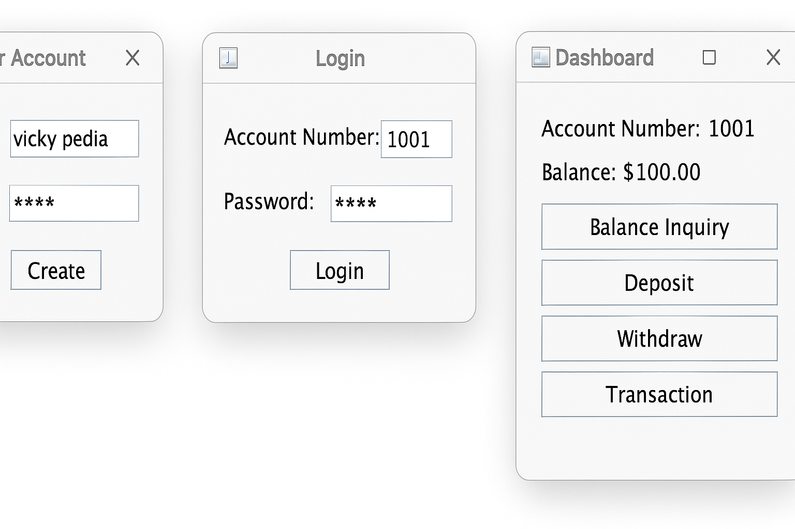

# 💳 Banking Management System

A Java-based Banking Management System built using **Java Swing**, **MySQL**, and **JDBC** that simulates core banking operations such as user registration, login, balance inquiry, deposit, withdrawal, and transaction management.

---

## 🧩 Problem Statement

In the modern banking era, secure and efficient management of customer data and transactions is crucial. Many small financial institutions or learning environments lack digital banking tools for practice and testing.  
This project provides a **user-friendly desktop application** to manage banking operations, mimicking real-world functionalities.

---

## 📷 Project Screenshots

> Screenshots from the Java Swing GUI

|  |

---

## ⚙️ System Requirements

### 💻 Software:
- Java JDK 11 or above
- MySQL Server
- MySQL Connector/J (JDBC driver)
- VS Code or IntelliJ IDEA

### 🧪 Database Setup:
Run this SQL command to create the database and table:

```sql
CREATE DATABASE banking_system;

USE banking_system;

CREATE TABLE users (
    id INT AUTO_INCREMENT PRIMARY KEY,
    username VARCHAR(50) UNIQUE,
    password VARCHAR(100),
    balance DOUBLE DEFAULT 0
);


## 🚀 Features
User Registration with input validation

Secure login with database authentication

Check account balance

Deposit and withdraw money

Transaction history logging

Swing GUI for intuitive use

Proper exception handling

## 🛠 Technologies Used
Java (Swing)

MySQL

JDBC

### ✅ Conclusion
This project is a functional prototype of a core banking system built for learning purposes. It demonstrates how to build real-world Java desktop applications integrated with MySQL databases using best coding practices and OOP concepts.


